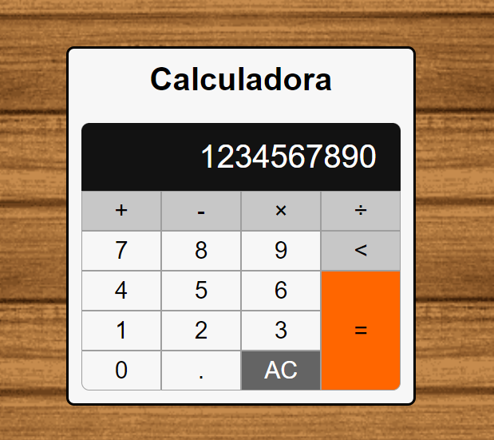

<h1> Calculadora JavaScript 2.0 </h1>

<h2> Link para acessar: </h2>
https://calculadora-js-2-0.vercel.app

<h2> Sobre o Projeto </h2>

<h4> Olá bem vindo ao meu projeto, nele foi desenvolvido uma calculadora em Javascript, HTML e CSS, onde podemos fazer: </h4>

<ul>
  <li>Adição</li>
  <li>Subtração</li>
  <li>Multiplicação</li>
  <li>Divisão</li>
  <li>Zerar tela</li>
  <li>Apagar último carácter</li>
  <li>Operações com números decimais</li>
  
</ul>

<h2> O que eu aprendi? </h2>

<h5>Aprendi a usar regex para localizar certas expressões dentro do visor da calculadora.</h5>
<h5>Aprendi a escrever dentro da tela usando o textContent</h5>
<h5>Aprendi a usar melhor as condições if e else.</h5>

<h2>Desenvolvido por:</h2>
<h3>Douglas Miranda</h3>
https://www.linkedin.com/in/douglas-miranda-939513247/